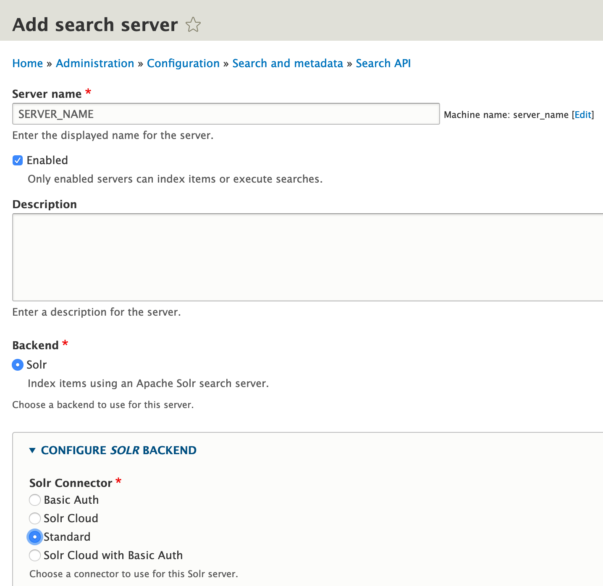
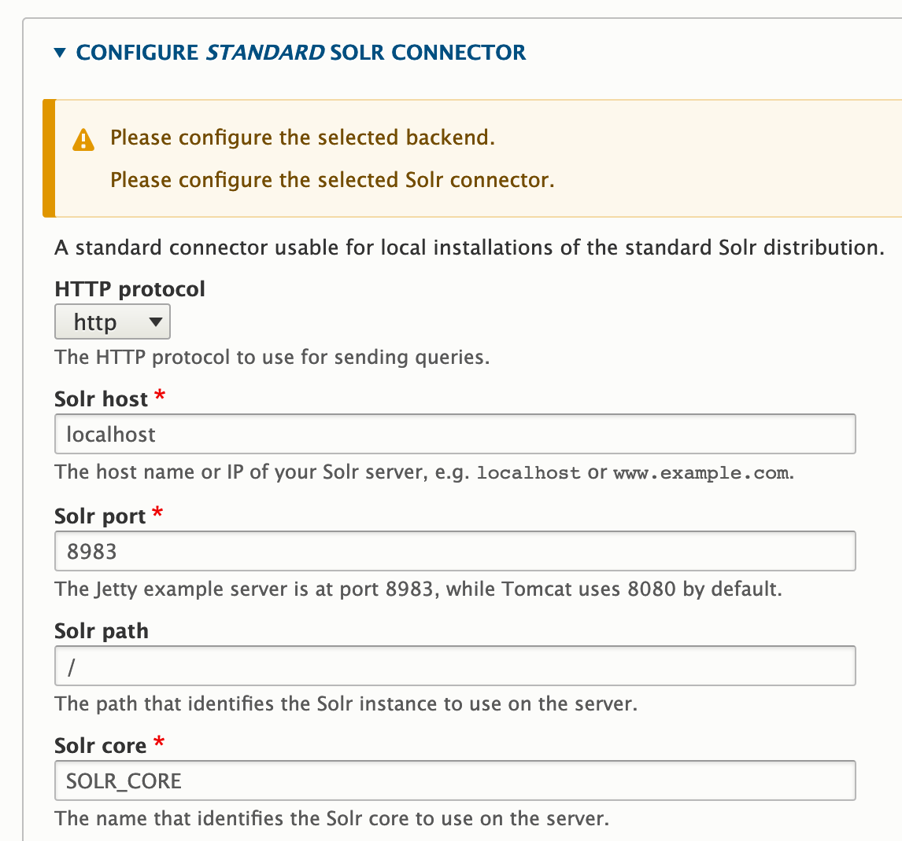

# Installing Solr

## In this section, we will install:
- [Apache Solr 8](https://lucene.apache.org/solr/), the search engine used to index and find Drupal content
- [search_api_solr](https://www.drupal.org/project/search_api_solr), the Solr implementation of Drupal's search API

## Solr 8

### Downloading and Placing Solr

The Solr binaries can be found at the [Solr downloads page](https://lucene.apache.org/solr/downloads.html); the most recent stable release of Solr 8 should be used.

```bash
wget -O solr.tar.gz SOLR_DOWNLOAD_LINK
tar -xzvf solr.tar.gz
```
- `SOLR_DOWNLOAD_LINK`: This will depend on a few different things, not least of all the current version of Solr. The link to the `.tgz` for the binary on the downloads page will take you to a list of mirrors that Solr can be downloaded from, and provide you with a preferred mirror at the top. This preferred mirror should be used as the `SOLR_DOWNLOAD_LINK`.

## Running the Solr Installer

Solr includes an installer that does most of the heavy lifting of ensuring we have a Solr user, a location where Solr lives, and configurations in place to ensure it’s running on boot.

```bash
sudo UNTARRED_SOLR_FOLDER/bin/install_solr_service.sh solr.tar.gz
```
- `UNTARRED_SOLR_FOLDER`: This will likely simply be `solr-VERSION`, where `VERSION` is the version number that was downloaded.

### Creating a New Solr Core

Initially, our new Solr core will contain a configuration copied from the example included with the installation, so that we have something to work with when we configure this on the Drupal side. We’ll later update this with generated configurations we create in Drupal.

```bash
cd /opt/solr
sudo mkdir -p /var/solr/data/SOLR_CORE/conf
sudo cp -r example/files/conf/* /var/solr/data/SOLR_CORE/conf
sudo chown -R solr:solr /var/solr
sudo -u solr bin/solr create -c SOLR_CORE -p 8983
```
- `SOLR_CORE`: `islandora8`

### Installing `search_api_solr`

Rather than use an out-of-the-box configuration that won’t be suitable for our purposes, we’re going to use the Drupal `search_api_solr` module to generate one for us. This will also require us to install the module so we can create these configurations using Drush.

```bash
cd /opt/drupal
composer require drupal/search_api_solr:^3.0
drush -y en search_api_solr
```

### Configuring search_api_solr

Before we can create configurations to use with Solr, the core we created earlier needs to be referenced in Drupal.

Log in to the Drupal site at `/user` using the sitewide administrator username and password, then navigate to `/admin/config/search/search-api/add-server`.

Fill out the server addition form using the following options:





- `SERVER_NAME`: `islandora8`
    - This is completely arbitrary, and is simply used to differentiate this search server configuration from all others. **Write down** or otherwise pay attention to the `machine_name` generated next to the server name you type in; this will be used in the next step.

### Generating and Applying Solr Configurations

Now that our core is in place and our Drupal-side configurations exist, we’re ready to generate Solr configuration files to connect this site to our search engine.

```bash
cd /opt/drupal
drush solr-gsc SERVER_MACHINE_NAME /opt/drupal/solrconfig.zip
unzip -d ~/solrconfig solrconfig.zip
sudo cp ~/solrconfig/* /var/solr/data/SOLR_CORE/conf
sudo systemctl restart solr
```
- `SERVER_MACHINE_NAME`: This should be the `machine_name` that was automatically generated when creating the configuration in the above step.
