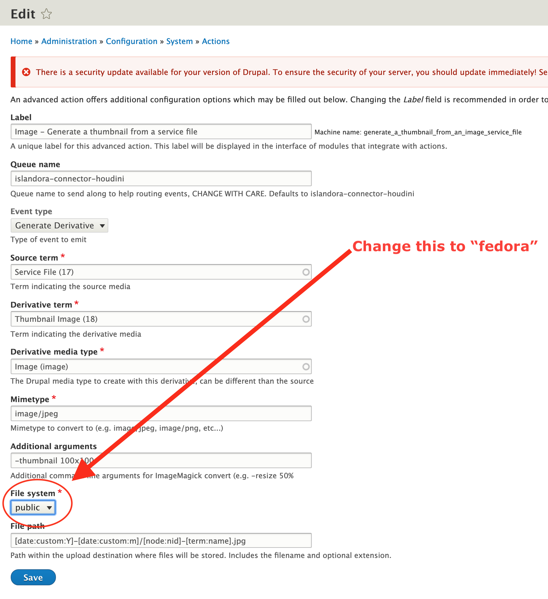

# Flysystem

Islandora uses [Flysystem](https://github.com/thephpleague/flysystem) and the [associated Drupal module](https://www.drupal.org/project/flysystem) to persist binary files to Fedora instead of keeping a copy in both Drupal and Fedora.

## Background

"[Flysystem](https://flysystem.thephpleague.com/docs/) is a filesystem abstraction library for PHP" which allows applications to read from and write to a variety of data source beyond the local file system, such as an [SFTP server](https://flysystem.thephpleague.com/docs/adapter/sftp/), [Amazon S3](https://flysystem.thephpleague.com/docs/adapter/aws-s3/), and [Zip files](https://flysystem.thephpleague.com/docs/adapter/zip-archive/) provided an [Adapter](https://flysystem.thephpleague.com/docs/advanced/creating-an-adapter/) is available to support it. Flysystem Adapters extend a single class implementing `League\Flysystem\FilesystemInterface` although some separate adapter traits for common actions and properties, such as the StreamedCopyTrait, are available.

The [Flysystem Drupal module](https://www.drupal.org/project/flysystem) extends Flysystem to work within the Drupal filesystem structure. Drupal flysystem plugins include a Flysystem adapter (if not provided by default or in another library) and a class implementing `Drupal\flysystem\Plugin\FlysystemPluginInterface` which instantiates the Flysystem adapter based on the Drupal site's configuration.

The Drupal filesystem descriptors are configured in the site's `settings.php` file; including the filesystem prefix, adapter (driver), and any adapter-specific configurations such as API endpoints and authorization information.

## Islandora's Implementation

### The Plugin and Adapter

Islandora 8 implements a [Flysystem adapter](https://github.com/Islandora-CLAW/islandora/blob/8.x-1.x/src/Flysystem/Adapter/FedoraAdapter.php) and a [Drupal Flysystem plugin](https://github.com/Islandora-CLAW/islandora/blob/8.x-1.x/src/Flysystem/Fedora.php). The Flysystem adapter acts as an intermediary between the Flysystem filesystem API and Fedora, translating requests and responses between them. The adapter interacts with Fedora using an instance of the [Chullo Fedora API](/Islandora-CLAW/chullo/blob/master/src/IFedoraApi.php) it receives from the Drupal Flysystem plugin. The Drupal Flysystem plugin's main responsibility is to instantiate the Chullo Fedora API object with the proper authentication and pass it to the Flysystem adapter. To authenticate with Fedora the plugin adds a [handler](http://docs.guzzlephp.org/en/stable/handlers-and-middleware.html) to the Chullo's [Guzzle](http://docs.guzzlephp.org) client which adds a [JWT](https://jwt.io/) authentication header to each request. <!-- After https://github.com/Islandora-CLAW/islandora/pull/119 is merged:  To authenticate with Fedora the plugin adds a handler to the Chullo's Guzzle client with a copy of the site's JWT authentication object so that each Fedora request can generate its own Bearer token. -->

The Fedora Flysystem adapter does not use Gemini to map the relationship between Drupal URIs and Fedora URIs, so they are indexed separately using the "files_in_fedora" Context which triggers the "Index Fedora File in Gemini" and "Delete Fedora File in Gemini" actions as appropriate.

### Configuration

The fedora file system is configured in the site's `settings.php` file. An example configuration can be seen in the claw-playbook webserver role's [drupal tasks](https://github.com/Islandora-Devops/claw-playbook/blob/master/roles/internal/webserver-app/tasks/drupal.yml#L12-L19):
```
$settings['flysystem'] = [
  'fedora' => [
    'driver' => 'fedora',
    'config' => [
      'root' => 'http://localhost:8080/fcrepo/rest/',
    ],
  ],
];
```
The configuration array's top-level key is the name of the Drupal stream wrapper, which also serves as the filesystem prefix. Any Drupal file path using "fedora://" will use this Flysystem adapter. Drupal will translate this prefix to the site's domain plus "\_flystem/fedora/". For example, using the default configuration provided by the claw-playbook, a file stored at "fedora://test.tif" will persist to Fedora with the URI "http://localhost:8080/fcrepo/rest/test.tif" and will be accessible from the Drupal URL "http://localhost:8000/_flysystem/fedora/test.tif". The 'driver' value 'fedora' corresponds to [the plugin's machine name](https://github.com/Islandora-CLAW/islandora/blob/8.x-1.x/src/Flysystem/Fedora.php#L21). The 'config' section contains all the adapter-specific configurations. In this case, the only thing configured for the site is the Fedora REST end-point. (Change this value to match your own Fedora's location, if needed.) The JWT is configured separately.

Other examples of Drupal Flysystem configurations can be seen in [the module's README](http://cgit.drupalcode.org/flysystem/plain/README.md?h=8.x-1.x).

Islandora is configured to have all Media use the Fedora file system by default in the islandora_core_feature. For example, the [field storage uri_scheme setting for field_media_image](https://github.com/Islandora-CLAW/islandora/blob/8.x-1.x/modules/islandora_core_feature/config/install/field.storage.media.field_media_image.yml#L17) (and the other media types) is "fedora". This can also be viewed in the UI on the field's "Field settings" page; e.g. `http://localhost:8000/admin/structure/media/manage/image/fields/media.image.field_media_image/storage`, look for "Upload destination" and see that "Flysystem: fedora" is selected.

However, there are methods for saving files that can explicitly set a different filesystem than the default. Migrations can explicitly set which file system a file is saved to and Islandora can emit events that also specify which file system a derivative should be saved to.

# Derivatives

As hinted in the previous section, Islandora, by default saves derivatives to the Drupal public file system.

For example, if I upload a Tiff to a repository item as a File Media with the term "Original File", the "Image Original File" ([image_original_file](https://github.com/Islandora-CLAW/islandora_demo/blob/8.x-1.x/config/install/context.context.image_original_file.yml)) Context is triggered. This fires the ['image_generate_a_service_file_from_an_original_file' action](https://github.com/Islandora-CLAW/islandora_demo/blob/8.x-1.x/config/install/system.action.image_generate_a_service_file_from_an_original_file.yml) which emits an event using the ['public' scheme (file system)](https://github.com/Islandora-CLAW/islandora_demo/blob/8.x-1.x/config/install/system.action.image_generate_a_service_file_from_an_original_file.yml#L17).

To make Islandora save future derivatives to Fedora instead of to Drupal, change the corresponding action's "File system" setting ('scheme' in the corresponding config file) to 'fedora' instead of 'public'.


