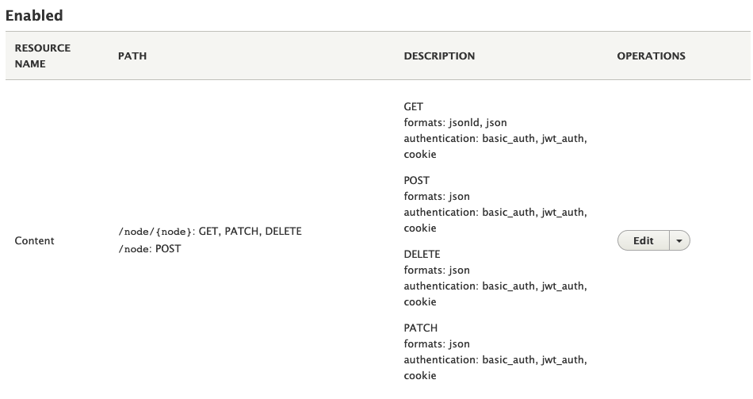

# Islandora 8 via REST

Each node, media and file in Drupal 8 has its own URI and we can GET the resources, some in a variety of formats.

We can also create nodes, media and files in Drupal by using PUT and/or POST requests.

We can update the field content by using a PATCH request and lastly we can DELETE a node, media or file resource.

To perform these actions, you will need the `RESTful Web Services` module enabled.

To configure your setup via the UI, you also need the `RESTful UI` module enabled.

Then you can configure your REST services at `https://<yourmachine>/admin/config/services/rest`

This screenshot shows the setup for resources, you can see the various HTTP methods and what formats they will respond in and what authentication methods they support.

1. [Authorization](./rest-authorization.md)
1. [Getting resources - GET](./rest-get.md)
1. [Creating resources - POST/PUT](./rest-create.md)
1. [Updating resources - PATCH](./rest-patch.md)
1. [Deleting resources - DELETE](./rest-delete.md)

## Further Reading

- [RESTful Web Services API overview](https://www.drupal.org/docs/drupal-apis/restful-web-services-api/restful-web-services-api-overview)

