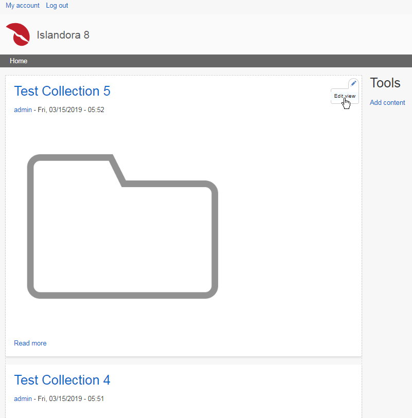
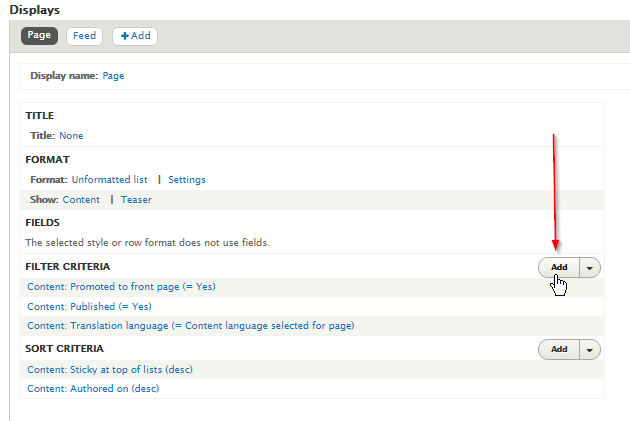
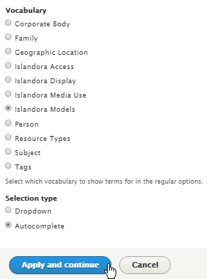
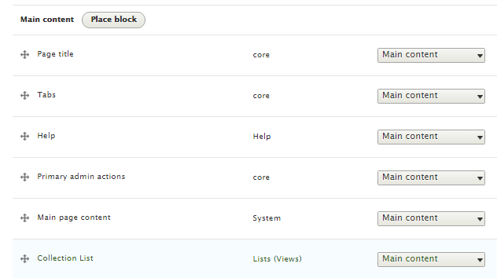

# Create or Update a View

## Overview

Views are powerful content filters that enable you to present Islandora (and other) content in interesting and exciting ways. For more documentation on views:

- [Drupal.org documentation on Views](https://www.drupal.org/docs/8/core/modules/views)

## Before you start

- The following How-To assumes that you are using the (optional) **[Islandora Defaults](https://github.com/Islandora/islandora_defaults)** configuration. This configuration is deployed automatically if you build your Islandora site using the [Ansible Playbook](/installation/playbook), [ISLE with Docker-Compose](/installation/docker-compose), or are using the [sandbox or a Virtual Machine Image](https://islandora.ca/try)
- This How-To assumes familiarity with Drupal terms such as [Node](https://www.drupal.org/docs/7/nodes-content-types-and-fields/about-nodes), [Content Type](https://www.drupal.org/docs/7/nodes-content-types-and-fields/working-with-content-types-and-fields-drupal-7-and-later), and [Media](https://www.drupal.org/docs/8/core/modules/media).

## How to modify an existing view

Islandora Defaults ships with some views already created and turned on. The Islandora 8 home page displays content items that have been added to Islandora. This view is named _Frontpage_ and it lists items that meet the following _filter criteria_: 

- The item is in the _published_ state.
- The checkbox Promoted to front page is selected. 

This view will display all content items added to Islandora, as the checkbox _Promoted to front page_ is on by default. 

As you develop your Islandora Web site it is likely that you will need to change the default behaviour of the _Frontpage_ View. As an example, the following describes how to edit the _Frontpage_ page view to only show content items and not collections.

For this example, we added six collection items to Islandora. In total there are eight items in the repository. In addition to the six collection items, there is one audio item and one image item.

1. Using your Web browser, open the Islandora front page 
    1. For this example, on the front page we can see that Islandora displays a 'Collection' first as this is the most recently added item.
2. To edit the front page view, hover over the view (_Frontpage_ view) and select **Edit view** when displayed.
    
3. Select **Add** under the _filter criteria_ section.
    
4. We do not want to display collections, so we need to add a _filter criteria_ that does not filter for the Islandora model type 'Collection'
    1. Select _Model_ from the list and then **Apply (all displays**).
    
    2. Select _Islandora Model_ to select filters on Islandora model types and select **Apply and continue**.
    
    3. Select the operator _Is none of_ and the _Collection_ model (autocomplete should work here to help you). To finish click **Apply (all displays)**.
    
    4. **Save** the view. Now the 'Frontpage' View does not display collections.
    
    
## How to create a new view
    
For this example, we create a new view that only shows collections. It will be created as a block that will only display on the front page. We will add the new collection list block below the existing frontpage view that lists items.

1.	Using your Web browser, open the Islandora 8 front page 
2.	Navigate to **Administration** >> **Structure** >> **Views** (~/admin/structure/views)
3.	Create a new view by selecting **Add view**
4.	Name the view and select **Create a block**. Give the block a title and decide how you want it to display (Grid, Table, List, Paging). To progress, select **Save and edit**.

5.	Customise the view format and sorting as required.
6.	Add a _filter criteria_ to only show the Islandora model type of 'Collection' and **Save** the view.

7.	To place the view on front page, the new block must be added to the 'Main page content' area (using 'Block layout') and set to display on the front page.
    1. Navigate to **Administration** >> **Structure** >> **Block layout** (/admin/structure/block). Under _Main content_ select **Place block**
    
    2.	Find the new block, 'Collection List' and select **Place block**.
    3.	Restrict the block to only display on the frontpage by adding the text '<front>' to the _Page_ vertical tab. Then select **Save block**.
    
    4.	Review the block placement and move if required.
    
8. The 'Collection list' now only displays on the front page. It displays below the _Main page content_.

!!! Tip "Islandora Quick Lessons"
    Learn more with videos on [Basic Views](https://youtu.be/Ge14g8nBUBQ) and [Advanced Views](https://youtu.be/inPRZeQGnKI).
