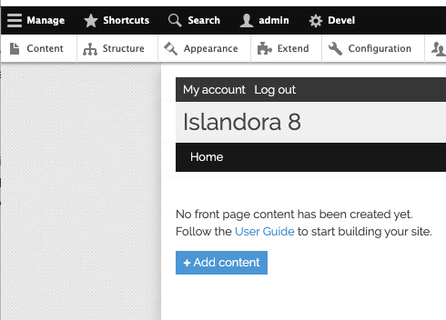
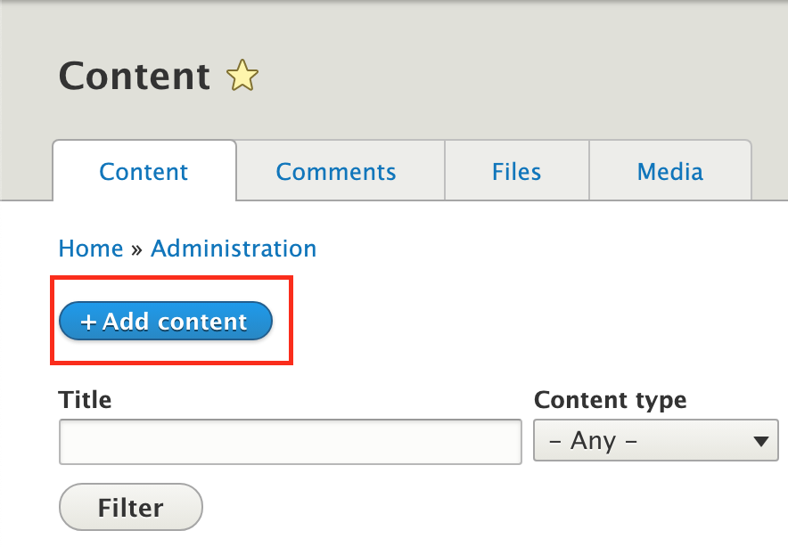
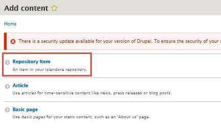
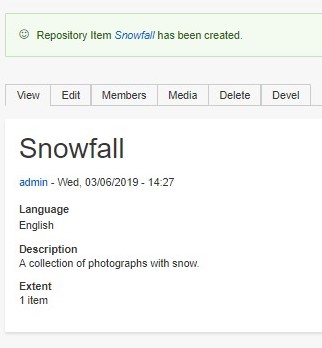
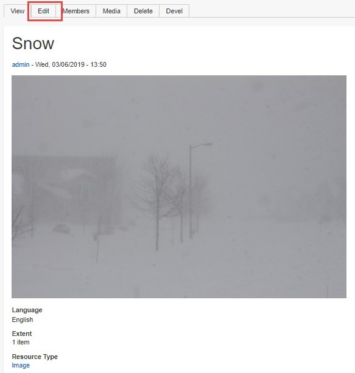
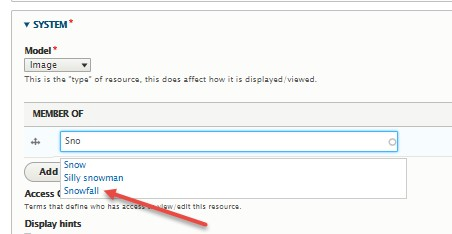
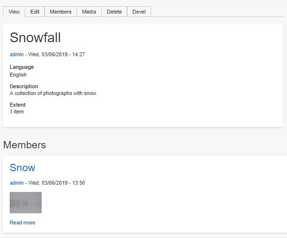
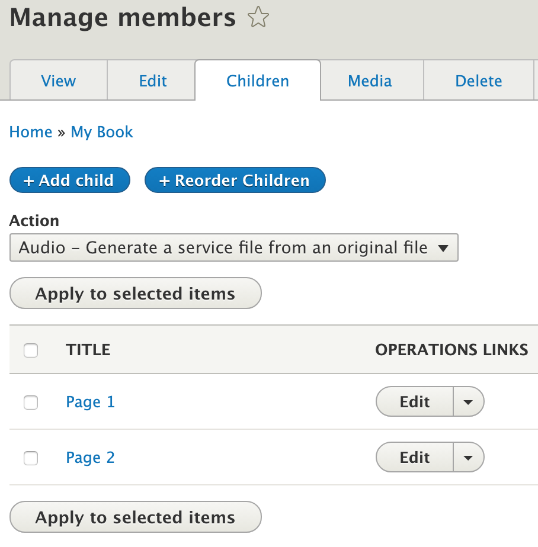

# How to create and add to a Collection

This how-to demonstrates creating a collection and adding items to it in Islandora Defaults. For more about collections, see [Concept: Collection](../concepts/collection.md).

## Introduction

In Islandora Defaults, Collections that are tagged as "Collection" under System > Model will show a view of their member objects. A member is any object that is "member_of" that object, and can be added via the "Members" tab. This is the mechanism in Islandora Defaults; individual instances may vary.

!!! Warning "Collections and Deleting"
    Collections and their members are independent of each other, 
    and removing something from a collection does not delete it. 
    **Similarly, deleting a collection does not delete its members.**

## Creating a Collection

When logged in as an administrator, click the _Content_ button under the _Manage_ tab.

Click on _Add content_.

Then click on 'Repository Item' to give your collection the default metadata profile for Islandora 8.

Fill out the form.

Near the end of the form, under System, select Collection from the Model dropdown list.

 

Click Save when done.

The collection has been created. Now let's add some members to this collection.

## Add Existing Items to a Collection

To populate a collection with existing items, return to any existing content and click on its Edit tab. This brings up the form for this item.

Scroll down to the bottom and the System section. In the Member of section, start typing in the name of the collection this item should belong to. Select the name of the collection 
you want from the autocomplete.

The correct collection is now selected.  Click Save when ready.

To confirm, return to the collection and verify the new item appears in the collection's 'Members' block.

## Add a New Item as a Member of a Collection

To create an item and add it as a member to a collection in one step, visit a collection and click on its `Members` tab. From the
`Members` tab, you can manage the members of a collection and perform actions on them.

Click on the `+Add member` button, and then select 'Repository Item' to give your new item a Content Type.  Only content types that
have the `field_member_of` field will be available from this list.

You are taken to the creation form for a Repository Item, but if you scroll down to the `System` section, you should see the widget
for 'Member Of' is already filled out for you with the appropriate collection.

Click 'Save' at the end of the form to create the new item and add it as a member of the collection.

!!! Tip "Islandora Quick Lessons"
    Learn more with this video on [Making a Collection](https://youtu.be/9jFVAE6l4so).
