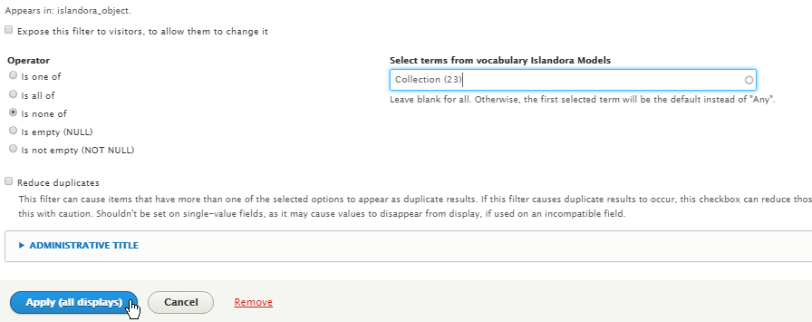
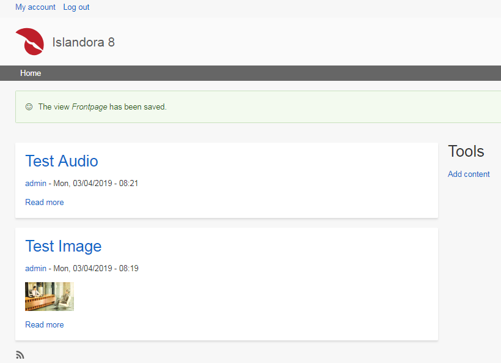
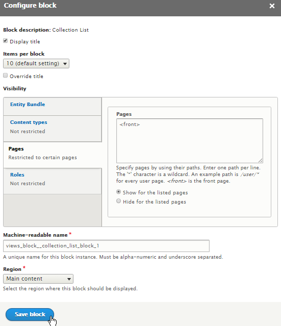

## Create / Update a View

Views allow you to get your content in Islandora to display on your site in pages or as posts, lists, blocks, etc. Views are powerful and filter content from Islandora to enable you to present content in interesting and exciting ways. 

Islandora 8 ships with views already created and turned on. The Islandora 8 home page displays content items that have been added to Islandora. This view is named 'Frontpage' and it lists items that meet the following **filter criteria**. The item is published and the checkbox 'Promoted to front page' is selected. This view will display all content items added to Islandora as the checkbox 'Promoted to front page' is on by default. 

As you develop your Islandora Web site it is likely that you will need to change this default behaviour of the 'Frontpage' view. The following two tasks demonstrate how to 1) Edit the 'FrontPage' view and 2) Create a new view.

### Task 1: Edit the 'Frontpage' page view to only show content items and not collections

For this example, we added six collection items to Islandora 8. Now, in total there are eight items in the repository. In addition to the six collection items there is one audio item and one image item.

1. Using your Web browser open the Islandora 8 Frontpage (localhost:8000 or your test Islandora)
    1. For this example, on the frontpage we can see that Islandora displays a 'Collection' first as this is the most recently added item.
2. To edit the frontpage view, hover over the view ('Frontpage' view) and select 'Edit view' when displayed.
    
3. Select 'Add' under the **filter criteria** section.
    
4. We do not want to display collections, so we need to add a **filter criteria** that does not filter for the Islandora model type 'collection'
    1. Select 'Model' from the list and then 'Apply (all displays)'.
    
    2. Select 'Islandora Model' to select filters on Islandora model types and select 'Apply and continue'.
    
    3. Select the **operator** 'Is none of' and the 'Collection' model (autocomplete should work here to help you). To finish select 'Apply (all displays)'.
    
    4. 'Save' the view. Now the 'Frontpage' view does not display collections.
    
    
### Task2: Add a new view to only show collections

**[Note to reviewer, I really don't have much experience with Drupal so there may be a more efficient way for placing a view on the frontpage?]**

For this example, we create a new view as a block and place the new block to only display on the frontpage. We will add the new collection list block below the existing frontpage view that list items.

1.	Using your Web browser open the Islandora 8 Frontpage (localhost:8000 or your test Islandora)
2.	Navigate to Administration > Structure > Views (~/admin/structure/views)
3.	Create a new view by selecting 'Add view'
4.	Name the view and select 'Create a block'. Give the block a title, decide how you want it to display (Grid, Table, List, Paging). To progress, select 'Save and edit'.

5.	Customise the view format and sorting as required.
6.	Add a **filter criteria** to only show the Islandora model type of 'Collection' and 'Save' the view.

7.	Place view on frontpage. Now that we have a view as a block, we add it to the 'Main page content' area (using 'Block layout') and only display for the frontpage.
    1. Navigate to Administration > Structure > Block (/admin/structure/block). Under 'Main content' select 'Place block'
    
    2.	Find the new block, 'Collection List' and select 'Place block'.
    3.	Restrict the block to only display on the frontpage by adding the text '<front>' to the 'Page' vertical tab. Then select 'Save block'.
    
    4.	Review the block placement and move if required.
    
8. The 'Collection list' now only displays on the frontpage. It displays below the 'Main page content'.

