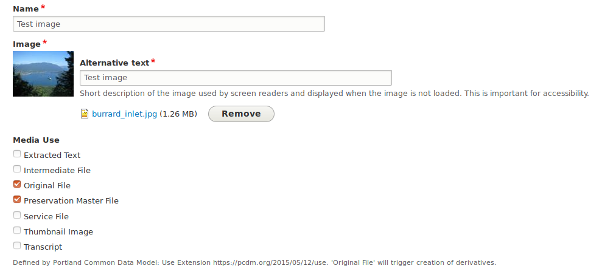

## Media in Islandora 8

Islandora 8's equivalent of Islandora 7.x datastreams are "media". Drupal 8 recognizes files (such as images, audio files, video files, etc.) but wraps each file in an intermediate structure called a "media" to allow us to attach fields (including Drupal tags) to files. It is in a media's fields that we store information about the media's file, such as file size, width and height (for images), alt text (for images), creation date, and so on.

Just as an Islandora 7.x object can have any number of datastreams, and Islandora 8 object can have any number of media associated with it. Unlike in Islandora 7.x, which used unique datastream IDs to indicate the function of a file ("OBJ", "TN", etc.), Islandora 8 uses Drupal tags from the "Media Use" vocabulary to indicate a file's function. The values for this vocabulary show up in the media edit form like any other Drupal vocabulary:

Because the Media Use vocabulary is an ordinary Drupal vocabulary, Islandora 8 site administrators can add their own tags, and in turn, these local tags can be used to identify media that have some custom local purpose. In fact, the Media Use vocabulary has some tags that identify files that have no real use in Islandora 8 but that are migrated from Islandora 7.x. The "Audit Trail", "Collection Policy", "Dublin Core File", "MODS File", and "RELS-EXT File" all fall into this category. These media are attached to an Islandora 8 object during migrations from Islandora 7.x, so that the content you created in Islandora 7.x can be identified after it has been migrated to Islandora 8, despite the differences between the two platforms.

### Derivatives

Islandora 8 generates derivatives much like Islandora 7 does. Just as Islandora 7.x's derivatives get assigned datastream IDs, Islandora 8's derivatives are assigned values from the Media Use vocabulary. For example, a thumbnail generated from am image is assigned the "Thumbnail image" tag. The derivatives are listed along with the rest of an Islandora 8 object's media, within the "Media" tab in the object:

For this image, we can see that a "Service File" and a "Thumbnail Image" derivatives have been generated and added to the object's list of media:

### Media revisions

Open issue: https://github.com/Islandora-CLAW/CLAW/issues/1035.

### Pre March 2019 sprint notes below

    * Files are attached to Nodes through Media (intermediary objects).
    * Media objects can also contain technical metadata about the files.
    * We use tags on the Media objects to determine how to display them (e.g. OpenSeadragon)
    * You can see what media is attached to a node on the node's "Media" tab
    * When you make a Media, it asks for a(nother) title and some alt-text. What should I put there? The node's title? Something else?
    * Where are files actually stored? See todo: make Flysystem section.
    * What does it mean for your content to be in Fedora? How does that happen and how do we check?
    * See access control section as it relates to files.
