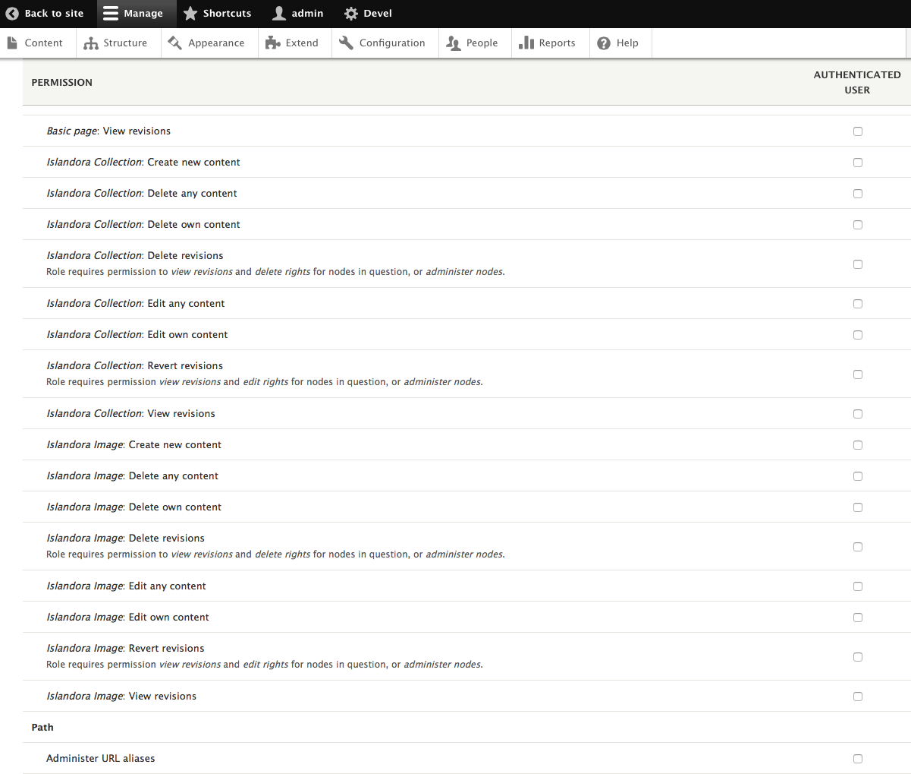
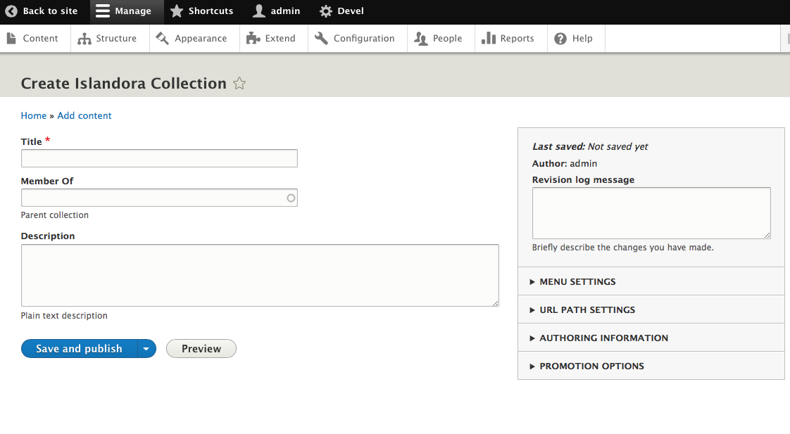
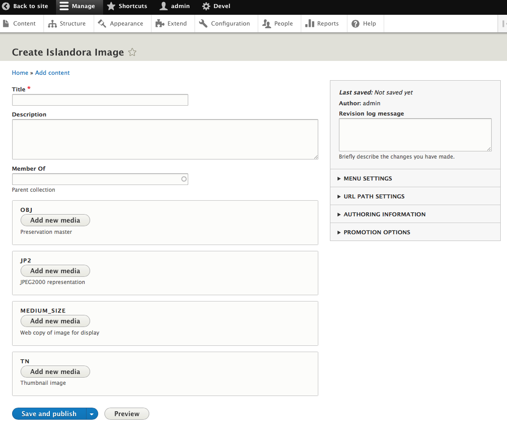

# Getting Started with Islandora CLAW

## How to Add a User
1. Log in under admin credentials.
2. Click the **Manage** tab from the top toolbar.
3. Select **People** tab from the resulting menu.
 
4. Enter all required fields, as indicated by red asterisks, in the *Add User* page.
5. Click on the **Create New Account** button at the bottom of the page.
6. To review/edit the permission for each role, click the **Permissions** tab in the set of tabs above the *Add User* button.

## How to Create a New User Role
1. Click the **Manage** tab from the top toolbar.
2. Select **People** tab from the resulting menu.
3. Click the **Roles** tab in the set of tabs above the *Add User* button.
4. Click the **Add role** button 
 
5. Name the role in a way that it can be disambiguated from related activities or similar groups
    * I.e. use the course code for a particular class of students working on a particular collection.
6. Click the **Save** button.
7. To edit the permissions for a role, click on the **Edit** dropdown menu to the right of the role and select **Edit Permissions**.
8. Scroll down until you see the *Node* section of options, until you see options that have an *Islandora* preffix. For example, *Islandora Collection: Create new content*.
    * Resource ‘type’ is what you’ll most often deal with
    * Resource entities are your baseline from which you build
    * RDF is a Fedora resource
    * RDF Source (i.e. descriptive information) is a Resource
    * Collections are now considered a type
    * Audio, Images, etc are also going to be types (this might require changes in the vocabulary we use Drupal "entities" (i.e. your core set of elements) and Drupal "bundles" (includes your entities plus other elements)
 

## Administrative Tasks

### How to Create a Collection
1. Click the **Manage** tab from the top toolbar.
2. Select **Content** tab from the resulting menu.

3. Click on **Add content** button. This will load the *Add content* page.

4. Click on **Islandora Collection** link. This will load the *Create Islandora Collection* page.
5. Fill out form fields. Enter all required fields, as indicated by red asterisks.
    * Title
    * Member of: Parent collection
        * This field will auto-populate
    * Description
    * Revision log message

6. Click the **Save and publish** button.

### How to Add an Item to a Collection
1. Click the **Manage** tab from the top toolbar.
2. Select **Content** tab from the resulting menu.

3. Click on **Add content** button. This will load the *Add content* page.

4. Click on **Islandora Image** link. This will load the *Create Islandora Image* page.
5. Fill out form fields. Enter all required fields, as indicated by red asterisks. [NOTE: currently the generation of image derivatives is not supported.]
    * Title
    * Description
    * Member of: Parent collection
        * This field will auto-populate
    * OBJ
    * JP2
    * MEDIUM_SIZE [NOTE: for now, just use this option to upload an object]
        * Click on "Add new media" button.
        * You must create some alternative text for the object.
        * Click "Create Media" button.
    * TN (Thumbnail)
    * Revision log message

7. Click the **Save and publish** button.
    * Once you upload a file, you can Edit or Remove it.

