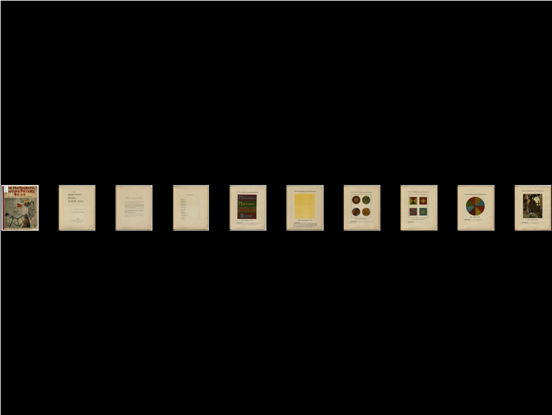

# IIIF (International Image Interoperability Framework)

[IIIF](https://iiif.io/) is a set of specifications that provides interoperability of image-based collections across platforms. What this means for a repository platform like Islandora is that image-based objects such as (still) images and paged content can be managed by Islandora but viewed in external applications, and that Islandora can bring in image-based content from elsewhere to supplement locally managed content.

At a practial level, because Islandora supports several of the IIIF specifications, we can:

- Zoom, pan, and rotate images within OpenSeadragon
   - Islandora uses an IIIF-compliant image server (by default, [Cantaloupe](https://cantaloupe-project.github.io/)) that utilizes the [IIIF Image API](https://iiif.io/api/image/2.1/). This capablity is similar to what Islandora 7.x users experience.
- See thumbnails for all pages of a book or newspaper issue within image viewers
   - IIIF-compliant image viewers such as OpenSeadragon or Mirador can display a "collection" of images such as all the pages of a book or newspaper issue using the [IIIF Presentation API](https://iiif.io/api/presentation/2.1/). For example, here is a screenshot of OpenSeadragon rendering all the pages of a book:
   
   

