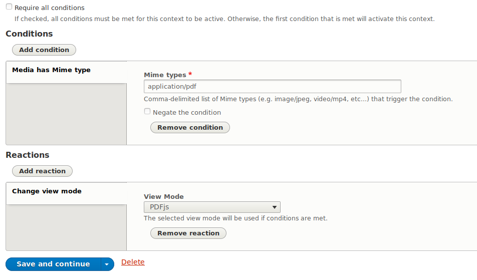

As we learned in Intro, objects in an Islandora repository are represented as nodes in Drupal.
Because of this, their metadata profile, display, form (and much more) are configurable through
the Drupal UI.  This gives repository administrators a huge degree of control over their repository
without any need for coding. Much more so than ever before. And since we're using a core Drupal
solution for modeling our objects, compatibility with third-party modules is virtually guaranteed.
This opens up a plethora of solutions from the Drupal community that will save you untold time
and effort when implementing your repository with Islandora.

## Properties

Nodes have some basic properties that are common to all nodes, regardless of content type.  These
properties are not fields.  This means that
they cannot changed or removed. Their name, what type of data they hold, etc... are all baked in.
Here's an example of the basic properties you'll see on a node:

```
nid: 1
uid: 1
title: "I am an Islandora 8 object"
created: 1550703004
changed: 1550703512
uuid: 02932f2c-e4c2-4b7e-95e1-4aceab78c638
type: islandora_object
status: 1
```

As you can see, it's all system data used at the Drupal level to track the basics.

Property | Value
------------ | -------------
nid | The local ID for a node
uuid | The global ID for any entity
title | The title for a node
created | Timestamp of when node was created
changed | Timestamp of when a node was last updated
type | Content type (e.g. which group of fields are present on the node)
status | Published, unpublished, etc...

!!! note "Compared to Islandora 7"
    These node properties directly correspond to following Islandora 7.x object properties:

    Islandora 7 | Islandora 8
    ----------- | -----------
    owner | uid
    dc.title | title
    PID | uuid
    status | status

## Fields

In addition to the basic node properties identified above, Islandora objects (like all Drupal nodes) can have fields.
Most of what we would think of as descriptive metadata is stored as fields. Since a specific set of required and optional
fields is assigned to a node by giving it a content type, we can think of content types as metadata profiles for our objects.
For example, you might have a content type for a set of repository objects that have very specialized metadata requirements but
another content type for generic repository objects that share a more general set of metadata fields.
The section on [metadata](metadata.md) describes in more detail how fields on Islandora objects work.

Islandora has a notion of a _content model_, which is used to identify what type of content is
being represented by a node (e.g. an image, a video, a collection of other items, etc...). This is done
using a special field, "Model", which accepts taxonomy terms from the "Islandora Models" vocabulary.
By applying a term from the Islandora Models vocabulary to a node, Islandora will become aware
of how to handle the node in response to certain events, like choosing a viewer or generating derivatives.


!!! note "Compared to Islandora 7"
    Content models in Islandora 7 were immutable, and contained restrictions as to what
    types of datastreams could be associated with an object.  Islandora 8 imposes no such
    restrictions. Content models can be changed at any time, and they in no way dictate what
    types of media can be associated with a node.

## Members

Islandora has a notion of _membership_, which is used to create a parent/child relationship between
two nodes. Any two nodes can be related in this way, though typically, the parent node has a content
model of Collection. Membership (to a Collection or otherwise) is denoted using another special
field, "Member Of".  The "Member Of" field can hold multiple references, so it is possible for a
single child to belong to multiple parents.

!!! Note "Compared to Islandora 7"
    In Islandora 7, there was a distinction between belonging to a collection and belonging to
    a compound object.  In Islandora 8, this distinction is not present, essentially making every object
    a compound object.

For any node, its "Members" tab can be used to see all its members.  You can also perform Actions in
bulk on members using the check boxes and the Actions drop down.


## Media

All nodes can contain any number of media.  The media for any node can be managed using the "Media" tab when viewing a node.  Much like
the "Members" tab, Actions can be performed in bulk using the check boxes and Actions drop down.


## Display Hints

Media are displayed in Islandora 8 via "view modes". View modes are Drupal's name for alternative ways to present content to users. In Islandora, the view mode determines whether a media is displayed using the OpenSeadragon viewer or the PDFjs viewer, for example. View modes can be set explicitly in the node edit form, or you can configure Islandora to use a specific view mode for all media with a specific Mime type.

At the node level, in the "Display Hints" field, simply check the display mode you want to use for that node:


The selected view mode will then be used when the node is viewed.

At a global level, you can create a [Context](context.md) that will detect the media's Mime type and use the configured view mode automatically. To do this, go to Drupal's "Structure" menu, then "Context" and create a new Context. Then, add a "Media has Mime type" condition and specify the Mime type, and add a "Change View mode" Reaction that selects the desired view mode:



Finally, save your Context.

These two approaches are not exclusive to one another. You can configure the view mode globally and override it at the node level if you want.