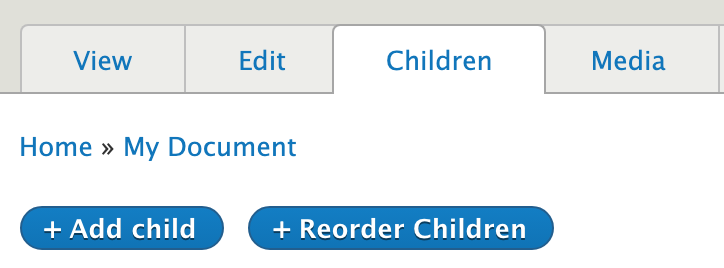
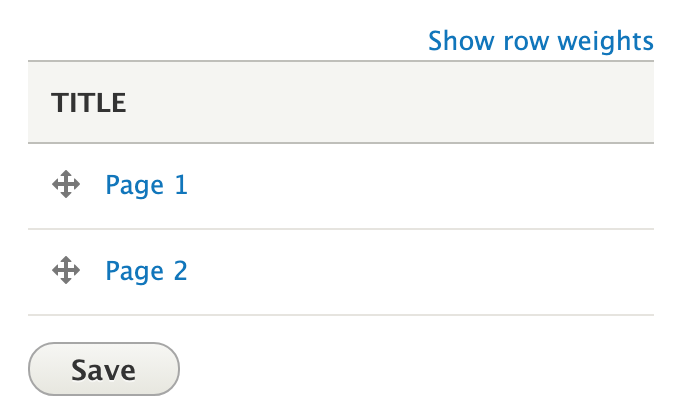

Paged content, books, periodicals, photographs with the front and back, etcetera, can use the members structure.
(See [the section describing resource node membership](resource-nodes.md#members).)
This involves creating a resource node for the root record (e.g. the book or the photograph)
and child resource nodes for each sub-component (e.g. "Page 1" and "Page 2" or "recto" and "verso")
with their corresponding media. Each "child" resource node contains a reference to their "parent" resource node
using the `field_member_of` property. 

Similar to the collection view showing members of a collection, Islandora provides a 
view to produce IIIF Manifest listing all the child resource nodes' service files
to a block displaying an OpenSeadragon viewer which is displayed only on resource
nodes with _Paged Content_ selected as their Islandora Model. However, repository
managers can use any method they like, such as a slide-show, to display child resource nodes.

By default child resource nodes are un-ordered. To order the sub-components of a
paged content resource node, Islandora provides a _Weight_ field to store a 
integer value on  child resource nodes. 
Children resource nodes with smaller weight values will come
before child resource nodes with larger weight values. This follows the usual ordering
pattern of `1` (smaller) coming before `2` (larger). 

Weight values do not need 
to be sequential, just ordered from smallest to largest. For example, the first 
child resource node can have a value of `10` and the next could have a value of 
`20` and they will be ordered accordingly. Should a new child be added with the 
weight value of `15` it will automatically be sorted after the child with the
weight value `10` and before the child with the weight value `20`.

Child resource nodes can be reordered using a drag-and-drop interface by clicking
on the _Re-order Children_ button on the _Children_ tab of the parent resource node.

Re-ordering children resource nodes on this page and clicking _Save_ will cause 
each child resource node's weight value to be updated using sequential values.

!!! note "Why not Drupal's book or weight modules?"
    Drupal provides the [book module in core](https://www.drupal.org/docs/8/core/modules/book)
    for creating multi-level ordered content, such as books and manuals.
    However, this module stores structure and pagination separately from the nodes making serializing
    these relationships as RDF we can provide to Fedora more difficult than simply using `field_member_of`
    with an RDF mapping. Support for the book module may be added in the future.
    
    Drupal also has a [weight module](https://www.drupal.org/project/weight) 
    that provides a weight field and a drag-and-drop
    reordering user-interface. However, this module requires users to set a 
    specified range of values which includes their negative corresponding value. 
    E.g. a range setting of '20' will require all children to have a value between 
    '-20' to '20'. This presumes a repository manager can predict how many pages
    the largest paged content item in their repository will be beforehand. Also,
    these weight values are serialized into RDF using the Collections Ontology 'index'
    predicate which assumes positive integer values which cannot be guaranteed
    using the weight module.