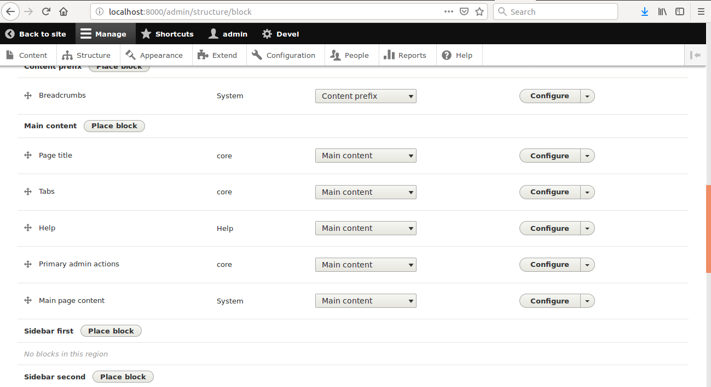
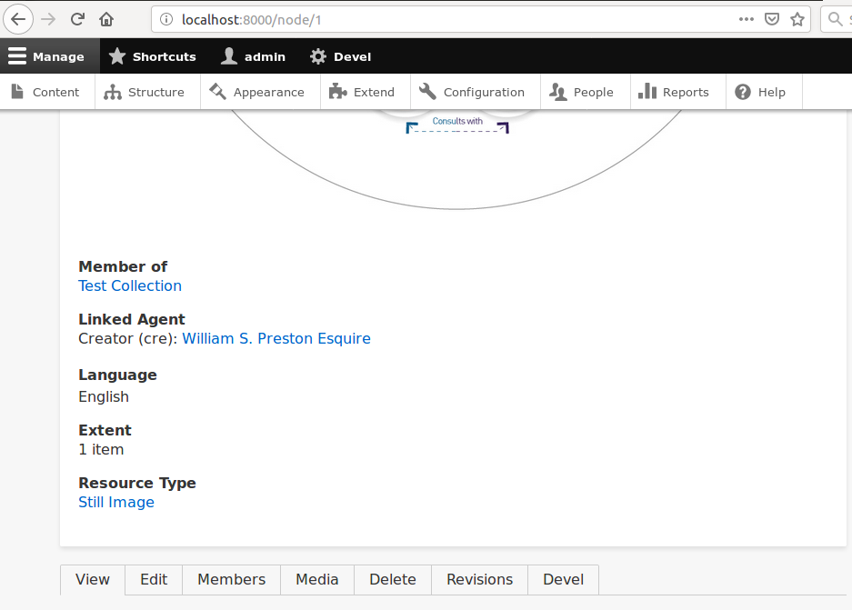
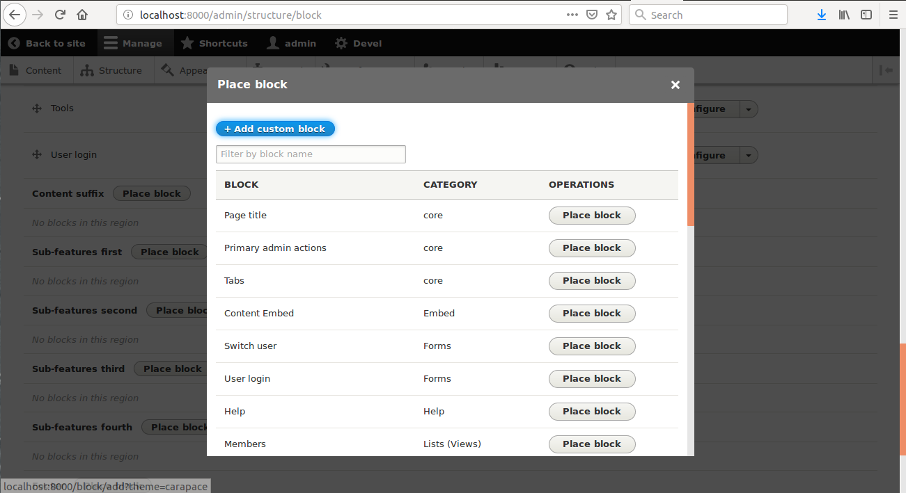
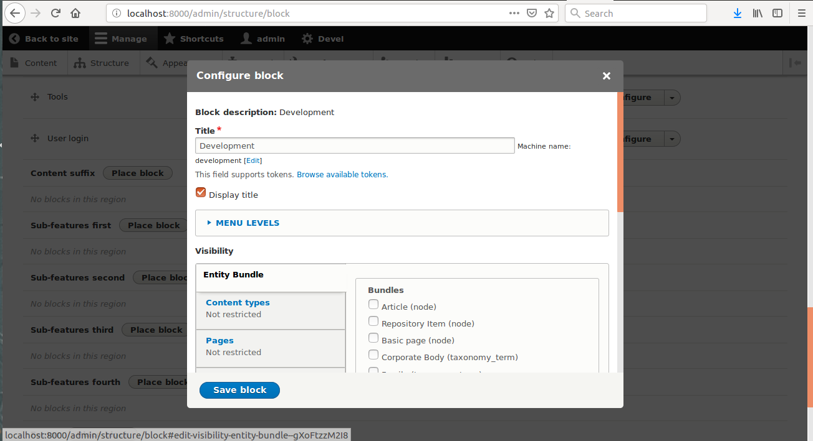
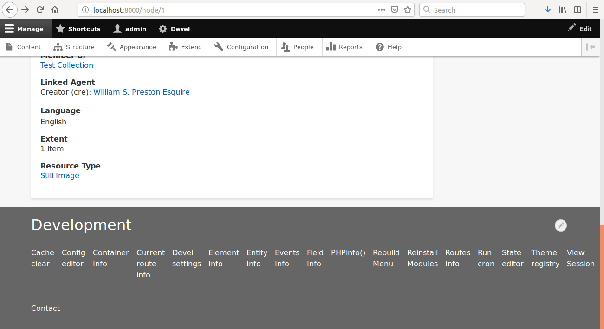
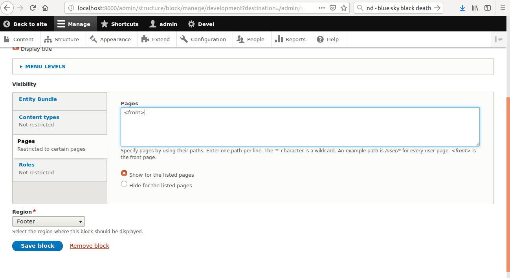
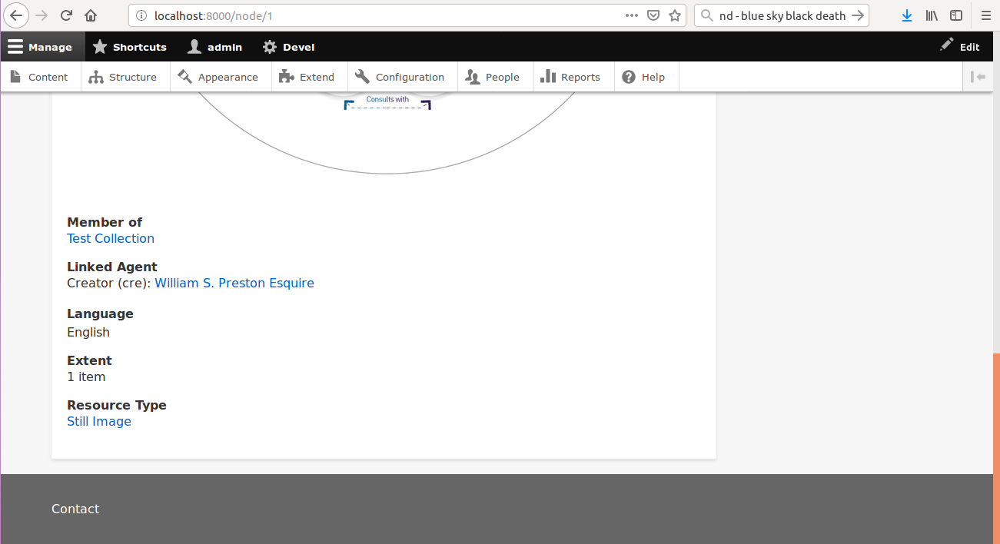
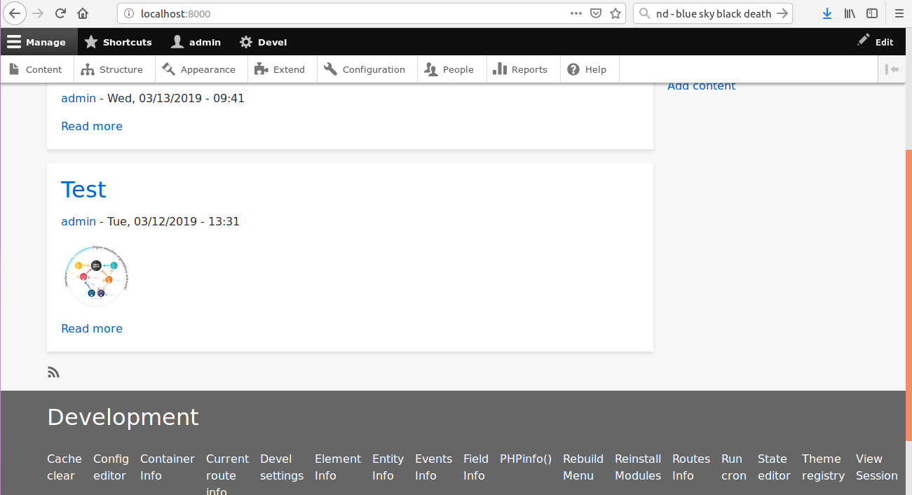
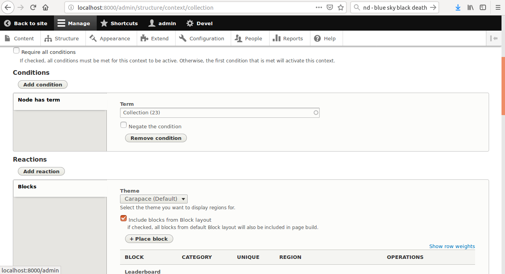
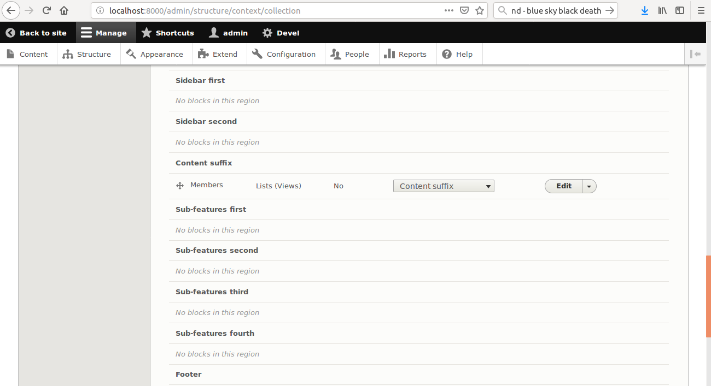

# Placing Blocks

## Using Block Layout

In Drupal, blocks are snippets of content that can be placed on pages within your website's layout. Some examples of blocks
are your site's menu, breadcrumbs, search block, etc...  You have a lot of control over when and where you see blocks using
Drupal's administrative interface.   You can create and delete blocks, as well as move them around in different locations 
on the page (called 'regions' in Drupal theme terminology).  You can also control on which pages the blocks are visible,
allowing you to conditionally show/hide them as appropriate.  Blocks are made available to place by enabling the Drupal
modules that provide them, and there's lots out there to choose from.  Placing blocks is an essential skill for any site
administrator, so let's jump right in and get our hands dirty.

Using the admin toolbar, navigate to Admin > Structure > Block layout (admin/structure/block).  You will see a table listing
all of the available regions provided by the current theme for block placement.  You can switch between available themes
using the tabs above the table.  For each region, enabled blocks are listed and can be re-arranged.  Take a look at the 
"Main Content" region for example.

If you wanted to move the content above its tabs, you could drag the "Main page content" block above the "Tabs" block.
If you scroll all the way down to the bottom and click the "Save blocks" button, now when you go to view content you
should see something like this

If you want to add a new block to a region, hit the "Place block" button for that region and you'll be brought to a modal
that will let you select which block to place.

After selecting your block, you will be brought to its configuration form.

Here you can give the block a different title, change its region using a dropdown, and control its visibility settings by
configuring various conditions. In our case, we're adding the "Development" block to the "Footer" region. And since we want
to see this block everywhere, we'll leave the visibility settings alone for now.  Click the "Save block" button, and now if
we go view some content we should see the "Development" menu in the footer of our site.

If we want to limit this eyesore to only the front page of our site, we can revisit the visibility settings of the block.
Navigate to the block we just placed on the block placement page, and click its "Configure" button.  Here you can limit
the block to show only for certain roles or content types.  You can also explicitly set a white or black list of pages,
which is what we'll do.

Click the Pages tab and you'll have a text area you can list pages in.  We're going to enter
`<front>`, which is a special value that means "The front page of your site".  Underneath the text area, you can select
whether you are showing or hiding the block for this list of pages.  We want to show this only on the front page, so we'll
leave it set at "Show for the listed pages".  Click "Save block" and go back to a piece of content.  You shouldn't see
the development menu.

But go to the frontpage and...

## Using Context

The visibility conditions in the block placement UI are simple and effective.  They cover the majority of use cases,
however, there are times when you need even more control.  This is where the Context module really shines. 
Any condition available to the Context module can be used to control block visibility.  And you can even combine conditions
using boolean (AND/OR) logic.

For example, in the `islandora_demo` feature, we provide a context specifically for showing a list of members of a collection.
All of our content is the same content type (Repository Item), and Collections are distinguished by being tagged with the
"Collection" taxonomy term.  Using the admin toolbar, if you navigate to Admin > Structure > Context (admin/structure/context),
you should see a list of all contexts available to the site.

Click the "Configure" button on the "Collection" context.

You can see in its "Condition" section, we have the "Node has term" condition, which checks for content tagged with the
term provided by the user.  In this case, it's set to look for the "Collection" tag.  Underneath, in the "Reaction" section,
you can see that the "Block" reaction has been selected, and its configuration looks a lot like the core block placement
UI.  
The only difference here is that when the "Include blocks from block layout" box is checked, you are only placing the blocks
you want to add in addition to an already existing block layout.  If you uncheck the box, you are creating an entirely new
block layout from scratch, and will have to replace basic things like breadcrumbs and menus.

Here you can see we've added only the members block to this block layout.  If we go and navigate to a collection, you'll
see its list of members underneath its content.

If we edit the collection and change its model tag from "Collection" to anything else, you'll see the block disappears!

As you can see, block placement can be very flexible, and allow you to customize your site in a very granular fashion.
Between using core block placement and the context module, there's no block you can't get into the right place on your site.
